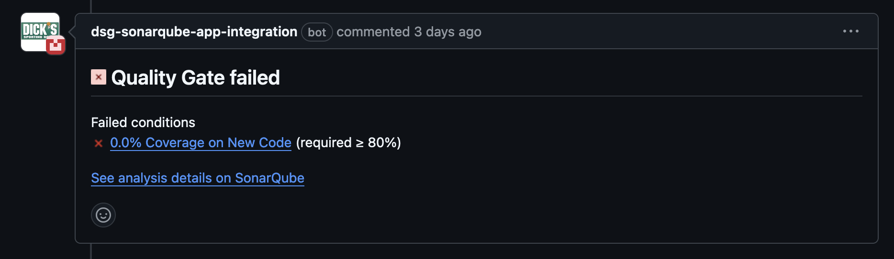

# General Contribution Guidelines
This project uses a 2 branch strategy, all development is done against the branch main, and production deployments happen
against the release branch.

1. No one is allowed to commit directly to the main branch.
2. All code merged into the main line is done through a Pull Request, that request has at least 1 approval.
3. All commit message are required to adhere to the conventional commit standard defined [here](https://dcsgcloud.atlassian.net/wiki/x/_YJIE).
4. When Pull Requests are approved, the repository is configured to not allow Merge Commits, you should either rebase or 
   "squash and merge", these two options will maintain a linear history.
   * If you choose to squash and merge, make sure you update the auto-generated message to meet the conventional commit
     standard above.
   * Before you submit a pull request it is strongly advised that you "rebase" your local branch against main. This will
     pull in any updates from main that have been merged since you created your local branch. This step will save you a
     lot of pain by resolving any merge conflicts before you submit your pull request.
5. When developing your code, all domain logic should be pulled out into modular framework code. 
6. Notebooks should be as reusable per domain as possible (e.g. prefer configuration over implementation), and notebooks
   utilize your modular code from #5. This will keep your notebooks as simple as possible.
7. Code should be organized by logical data domain and sub-domains under src/ecmde_ecomm (our primary python package). 
   We have the following domains:
   * common
   * ecomp
   * fulfillment
   * search
   * shipping
8. All module code should live under each domain, and all notebook/python tasks should be implemented in a notebooks
   package within that domain. Example: `search/notebooks/ltr_dbx_to_kafka_notebook.py`. For more detailed information
   on developing notebooks see [Developing Notebooks](./notebooks.md).

## Writing Modular Code
Your Python can be abstracted out into modular code (Classes or functions that encapsulate functionality). To aid in
code organization, and keeping imports cleaner, always be sure to import your classes and functions in the __init__.py
script within each package you work in.

```python
# As an example, in ecmde_ecomm/common/spark/__init__.py
from .pandas_udf import create_uuid5
from .util import spark_session
```

This allows us to import code at the package level vs. having to import from the script.
```python
# As an example, in ecmde_ecomm/common/notebooks/hash_key.py
from ecmde_ecomm.common.spark import create_uuid5, spark_session
```

Note: this is a relatively new pattern in our code base, so as you are working on a piece of modular code, if the imports
haven't been added to the __init__.py script in the package you're working in, go ahead and add them.

### Using Databricks Specific Imports/Code
If you need to use a Databricks SDK piece of code, please consider wrapping that code in a function that hides the use
of the vendor specific functionality. Doing so makes our code base far more portable and extensible in the future if we
choose another lakehouse provider that supports spark. We already have a few examples in our code base where we are doing
this.

* `ecmde_ecomm/common/spark/util.py#spark_session()`
* `ecmde_ecomm/common/util.py#NotebookUtil`
* `ecmde_ecomm/common/util.py#CredentialUtil`

Each of these wraps vendor specific code making our notebooks more portable in the future.

## Project Dependencies
Our project is bootstrapped using `pyproject.toml`, this file contains all the necessary elements our project needs in
order to be built, tested, and developed. There are a couple of ways that we can declare dependencies in our project,

1. Under [project] in the dependencies array. These dependencies are effectively treated as being "required" by our
   project, and any pip install will install these declared dependencies by default. Only include dependencies here if
   they are required at run time and are not provided by Databricks natively
   (e.g. spark, databricks-connect, databricks-sdk, etc).
2. Under [project.optional-dependencies], you can declare different blocks of dependencies. In our project we just have
   a single block of dependencies called "dev". This block declares all the optional dependencies you need for local
   development and import resolution.

When installing your dependencies for local development, it is recommended that you use an editable install.

```shell
    pip install -e ".[dev]"
```

The command above will install all required dependencies, along with all the optional dependencies under our `dev` block.
The editable install means that as you add new code, or modify existing code, your changes will be picked up by the python
interpreter.

## Sonar Scans
Our CI/CD workflows are connected to include the use of Sonar Scans, DSG's tool for ensuring code quality. Sonar Scans
be utilized to ensure all new code meets the 80% code coverage quality gate.

When you issue a pull request, two things happen.
1. We execute the unit-test suite using a tool called Coverage which will calculate test code coverage.
2. We execute a sonar scan which will ingest the coverage.xml file produced from test runs.

GitHub will include this as an attestation in the CI/CD workflow. If your pull request drops the code coverage below the
80% threshold, your PR will not be approved until you provide the adequate code coverage.

If you see this on your pull request, that is your sign to add additional coverage.


See the [Developing Automated Tests](testing.md) documentation for running your test suite locally with coverage. This
is the easiest way for you to ensure that your code meets our standards for quality before you submit a pull request.

## Typical Development Workflow
1. Create a local branch off main (don't forget to always do a fresh pull on main to ensure you're working on the latest
   copy of the code base).
2. Make your changes.
3. Write unit tests to validate your code (including ETL) behaves the way you expect (e.g. data is upper cased, defaults
   are applied, data is formatted appropriately, etc.).
4. Write any Flyway migrations that are required for your feature.
    * Migrations should be tested against your sandbox schema to ensure they apply correctly before a PR is submitted.
5. Deploy your asset bundle with the "local" target specified, you should ensure that your local target overrides any
   catalog or schema settings to target your sandbox schema.
6. Run your workflows from your local target and validate correct behavior and/or data accuracy.
7. Create a Pull Request to merge your code into the main line branch and deploy to Databricks non-prod and QA.