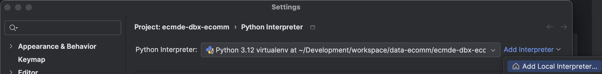
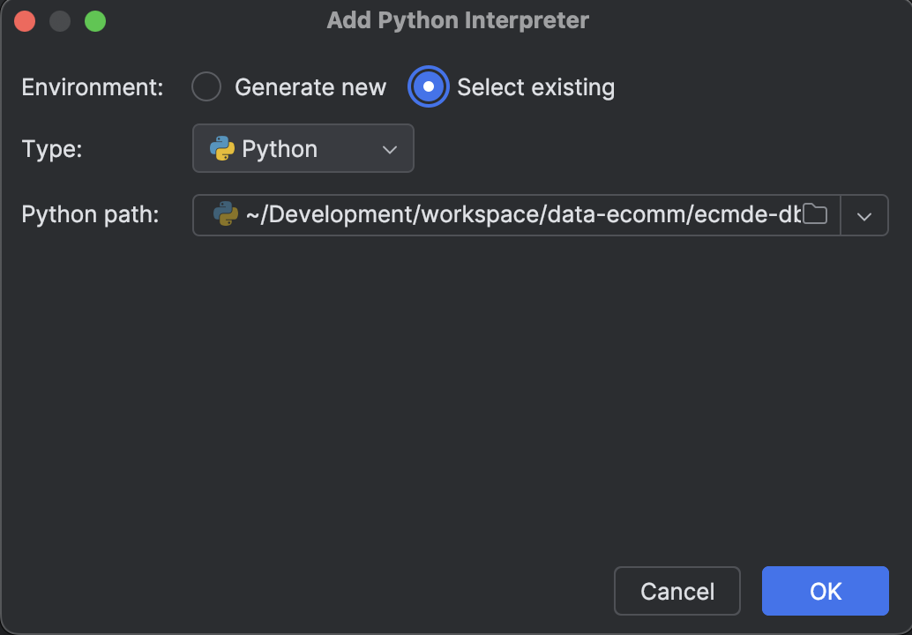
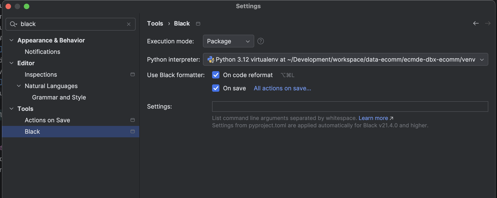

# Configure PyCharm
The steps below will ensure that your IDE is configured appropriate for contributing to this project.

## Python Virtual Environment
1. Clone the repo to your local system.
2. Create a Python Virtual Environment for the project by executing the following commands.
   ```shell
     python3 -m venv ./venv
     source ./venv/bin/activate
   ```
3. Validate your virtual environment is selected in PyCharm.
   1. In PyCharm settings go to the Python Interpreter setting for this project. 
      Hint: you can search settings by typing "Python Interpreter".
   2. Select "Add Interpreter"
      
      
   
   3. In the window that opens, select the "Select existing" option and set the path to point to your python binary in
      the venv/ folder you created above, and click the OK button when you are done.
      
      
4. Install required dev dependencies.
   ```shell
     pip install ".[dev]"
   ```

## Black Formatter
Code consistency is key to writing maintainable code. The Black Formatter will ensure that your code is formatted
consistently and kept to community standards.

1. Open PyCharm Settings, and type "black" in the search box.
2. Make sure your settings match the settings below

   