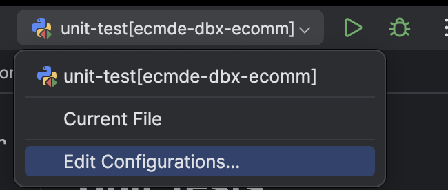
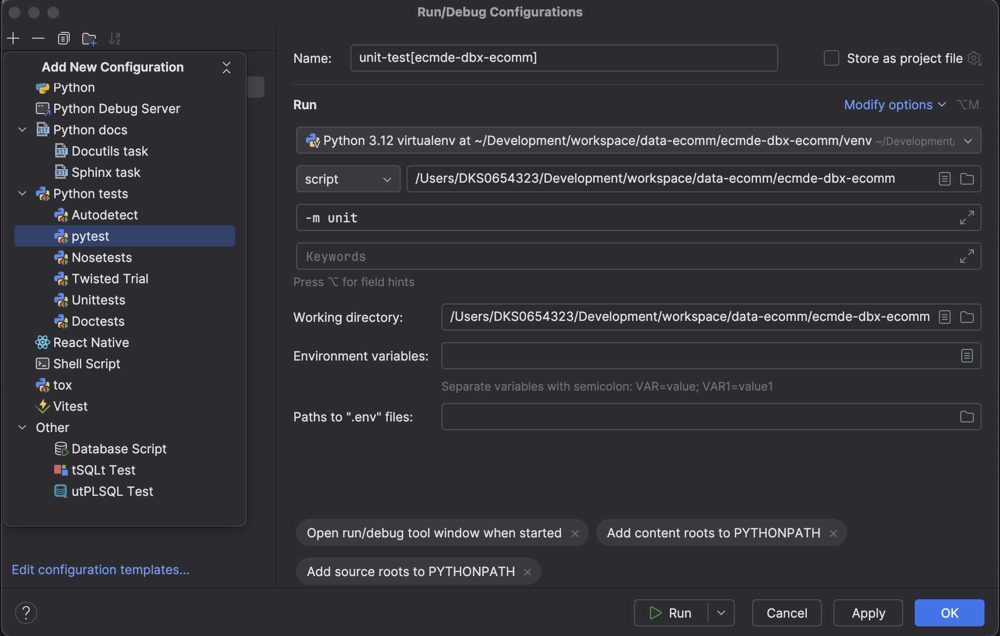
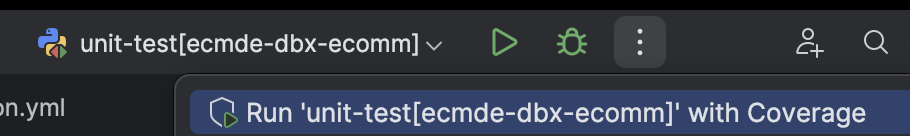

# Unit Tests
The instructions below will configure your environment for running unit tests locally on your machine. All code under 
the src/ directory is required to be covered with a minimum of 80% test coverage.

## Set ENV variables
Set the following ENV variables on your local machine in order to allow the databricks-sdk to auto-configure itself.

You can use any value here, or you can use the actual host name for the non-prod environment and your PAT for the token.
The unit test suite doesn't actually connect to any remote environment. These variables are just needed so that the
databricks-sdk can configure itself.

Modify your `~/.zshrc` file by adding the following export statements.
```
export DATABRICKS_HOST=https://mock-host.com;
export DATABRICKS_TOKEN=dapiMOCKTOKEN
```

## Creating Unit Tests
1. All unit tests should be placed in a directory structure that mimics the location of the source under test.
2. All unit test classes should be annotated with `@pytest.mark.unit`
3. Unit tests do not connect to an external resource (database, API, or the file system)
4. All external resources should be mocked and patched using monkeypatch
5. Unit tests only test behavior for the code under test (also known as behavior driven development, bdd)

## Running Unit Tests from the Command Line
You can run tests from the command line by executing the following command.
```shell
    python -m pytest -m unit
```

## Running Unit Tests from PyCharm
The instructions below will allow you to setup a run configuration in Pycharm that will allow you to run the test
package, debug and step code in your test package, and run your test package with "Coverage".

### Create a Run Configuration for the Test Package
You should create a run configuration that will execute our unit test package locally. Before you create a pull request,
you should run the entire package first to ensure that you have not introduced any regression.

1. From the toolbar, select Edit Configurations.

    
2. From the window that opens, hit the + button and select pytest configuration.

   
   1. Give you run configuration a name (like "unit-test[ecmde-dbx-ecomm]").
   2. Make sure the python binary path is set to your virtual environment path.
   3. Set the path next to "script" to be the fully qualified path to your project directory.
   4. In the additional arguments field, set the value to -m unit.
   5. Set the "Working directory" value to the fully qualified path to your project directory.
3. Click the OK button to save your settings.

### Running the Test Package
To run your unit-test package, select your run configuration you created from the above steps.


1. To run the package hit the Play button.
2. To debug and step your code, hit the Debug button.
3. Click on the ellipses, and select Run 'your run config name' with Coverage
   * This is how you can tell when you've sufficiently tested your code. You should strive to hit 100% coverage where 
     possible, but at a minimum you will be required to hit 80% code coverage before any pull request is approved.